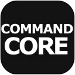

# CommandCore

<p align="center">
  
</p>

<p align="center">
  <b>Is an Unreal Engine plugin that brings the Command Design Pattern into your project</b><br/>
  CommandCore giving you a clean, reusable, and designer-friendly way to trigger gameplay logic from anywhere in your game.
</p>

<p align="center">
  
  
  
</p>

---

**CommandCore** is an Unreal Engine plugin that implements the **Command Design Pattern**, giving designers and programmers a clean, reusable, and editor-friendly way to trigger, sequence, and chain gameplay logic — without writing custom Blueprint wiring for every interaction.

> ⚠️ **Status: Beta (v1)**
> This plugin is under active development and **not recommended for production use**. APIs, class names, and behavior may change between versions without backward compatibility. Use at your own risk in shipping projects — feedback and bug reports are welcome while it stabilizes.

---

## Overview

CommandCore is built around a simple idea: **encapsulate an action as an object**. Instead of scattering gameplay logic across Blueprints and event graphs, each action — playing a sound, applying damage, spawning an actor, blending a camera, setting light properties — becomes a self-contained `UCommand` that can be configured entirely from the Details panel and reused anywhere in your project.

Commands are triggered by **Executors** (regular, ordered lists) or **Sequencers** (timed, timeline-based lists), and both can be driven by any actor — most commonly the included Command Trigger Box.

---

## Core Concepts

### `UCommand`
The abstract base class for every action. Concrete commands (`UCommand_PlaySound`, `UCommand_SpawnActor`, etc.) override `Execute` and `CanExecute` to define their behavior. Because `UCommand` is `EditInlineNew` + `Instanced`, designers can add any number of them directly in the Details panel — picking a class from a dropdown and configuring its exposed properties — without touching code. Commands can also be authored entirely in Blueprint by subclassing `UCommand`.

Every command receives two actors on execution:
- **OwnerActor** — the actor that holds/owns the command (e.g. the actor with the Command Executor component).
- **InstigatorActor** — the actor that triggered the execution (e.g. the actor that overlapped a trigger).

### `UCommandExecutorComponent`
An Actor Component that holds an ordered list of `UCommand` instances and runs them in sequence when `ExecuteCommands(InstigatorActor)` is called. Broadcasts an event whenever it runs.

### `UCommandSequenceComponent`
Like the Executor, but each command is paired with a **Timeline** offset (in seconds). Once started, commands fire automatically as the internal timer reaches each one — useful for lightweight scripted sequences/cues without needing a full Sequencer asset.

### `ACommandTriggerBox`
A ready-to-use trigger volume with two Command lists — one for **Begin Overlap**, one for **End Overlap** — plus built-in filtering:
- **Required Tags** — only actors with at least one matching tag pass.
- **Include Actors** — whitelist by class.
- **Exclude Actors** — blacklist by class (always takes priority).

Defaults to requiring the `"Player"` tag out of the box.

---

## Included Commands

| Command | Description |
|---|---|
| `UCommand_ApplyDamage` | Applies damage to the Instigator via `UGameplayStatics::ApplyDamage`. |
| `UCommand_PlaySound` | Plays a sound 2D or at a 3D location (Owner/Instigator/Custom gizmo point), optionally as a controllable Audio Component. |
| `UCommand_MovementControl` | Plays/pauses a generic `UMovementComponent` with optional Max Speed / Gravity Scale overrides. |
| `UCommand_InterpMovementControl` | Controls a `UInterpToMovementComponent` — Control Points, Duration, Behaviour Type, Pause/Resume. |
| `UCommand_RotatingMovementControl` | Controls a `URotatingMovementComponent` — Rotation Rate, Pivot Translation, local/world space. |
| `UCommand_SetCharacterMovementProperties` | Sets `UCharacterMovementComponent` properties (Movement Mode, speeds, jump, air control, crouch) if the target is a Character. |
| `UCommand_DestroyActor` / `UCommand_DestroyActors` | Destroys a single resolved actor, or a list of actors from the scene. |
| `UCommand_SetActorEnabled` | Toggles Visibility, Collision, and Tick on a list of actors, individually or via a master enable/disable switch. |
| `UCommand_SetCollisionProperties` | Sets collision enabled state, profile, overlap events, physics simulation, and hit notifications across a list of actors. |
| `UCommand_SetPhysicsProperties` | Sets simulate physics, gravity, mass, damping, velocity, and rotation locks across a list of actors. |
| `UCommand_SetLightProperties` | Sets Intensity, Light Color, Cast Shadows, Visibility, Attenuation Radius, and Temperature across a list of `ALight` actors. |
| `UCommand_AddComponent` | Adds a new component of a given class to a target actor at runtime. |
| `UCommand_DestroyComponent` | Removes a specific component from a target actor, disambiguated by tag if multiple of the same type exist. |
| `UCommand_AttachActor` | Attaches a target actor to another actor (Instigator or a specific scene actor), with configurable attachment rules. |
| `UCommand_SpawnActor` | Spawns an actor from a class, with a Manual or From-Actor transform, optionally destroying the reference actor afterward. |
| `UCommand_PlayMontage` | Plays an Animation Montage on a target's Skeletal Mesh Component (with optional section jump and component disambiguation by name). |
| `UCommand_PlaySequence` | Plays/pauses/stops/reverses a Level Sequence — either a placed `ALevelSequenceActor` or one spawned at runtime from a `ULevelSequence` asset. |
| `UCommand_SpawnNiagaraSystem` | Spawns a Niagara System attached to an actor or at a world location (Manual or From-Actor transform). |
| `UCommand_CreateWidget` | Creates a `UUserWidget` and adds it to the resolved player's viewport, with optional UI-only input mode. |
| `UCommand_PlayCameraShake` | Plays a Camera Shake on the resolved player's Camera Manager. |
| `UCommand_BlendCamera` | Blends the resolved player's view to a `ACameraActor` (or back to their Pawn), with optional controller rotation matching. |
| `UCommand_ModifyBlackboard` | Sets one or more typed key/value pairs on a target's AI Blackboard. |
| `UCommand_ModifyActorTags` | Adds and/or removes Gameplay Tags on a target actor. |
| `UCommand_CallEvent` | Calls a named Event/Function by reflection on a specific actor or all actors of a class in the scene. |

All commands share the same `OwnerActor` / `InstigatorActor` resolution pattern and a `Print()` helper for consistent on-screen `[CommandName]: message` debug logging.

---

## Getting Started

1. Add a **Command Executor** or **Command Sequencer** component to any actor.
2. Add entries to its **Commands** array and pick concrete command classes from the dropdown.
3. Configure each command's exposed properties directly in the Details panel.
4. Call `ExecuteCommands(InstigatorActor)` from Blueprint, C++, input events, or a **Command Trigger Box**'s Begin/End Overlap.

For quick testing, `ACommandTriggerBox` exposes `CallInEditor` buttons to run its command lists without entering Play mode.

---

## Requirements

Depending on which commands you use, the plugin depends on the following Engine modules:

```
Core, CoreUObject, Engine,
LevelSequence, MovieScene, MovieSceneTracks,
UMG, Slate, SlateCore,
Niagara,
AIModule, GameplayTasks
```

---

## Known Limitations (Beta)

- No built-in parameter passing for `UCommand_CallEvent` beyond a single optional bool argument.
- No native way for a command to pass a runtime result (e.g. a spawned actor) to the *next* command in a list — each command instance caches its own result, but sequencing that hand-off is currently manual.
- Command execution is synchronous; there is no built-in delay/async command chaining outside of `UCommandSequenceComponent`'s fixed timeline.
- Limited automated test coverage.

---

## License

*(Add your chosen license here.)*